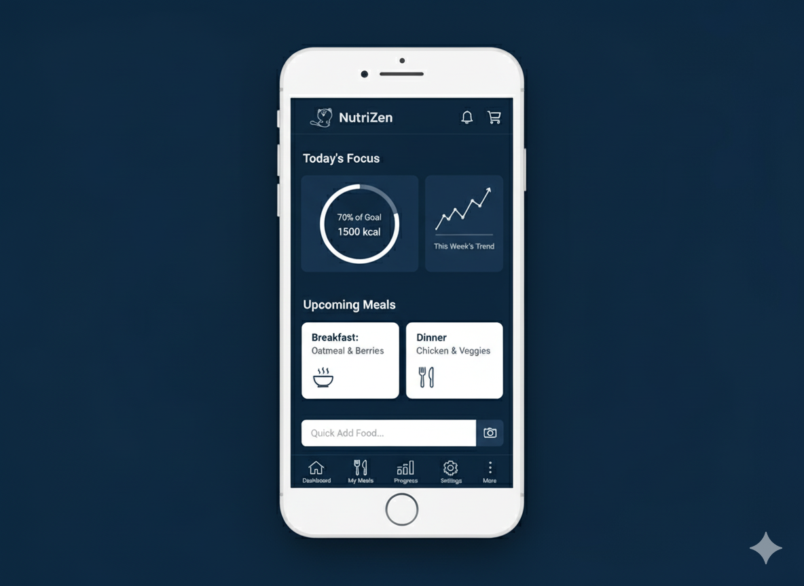

# NutriZen 😺  

<a href="README.md"><strong>English</strong></a> | <a href="README.pt-BR.md">Português</a>

  

<h3 align="center">Your health journey, built by the community.</h3>

  Nutrition, training, and wellness in a 100% free, open-source, and ad-free app.

    
    
    
    
    

---

## 📸 Screenshots / Demo (Work in Progress)

  
  

*(Mockups only — real UI coming soon!)*

---

## 💬 Join Our Community

NutriZen is made of people. Follow us, ask questions, and join the conversation on our social channels.

  
  
  
  

---

## 💡 Our Philosophy

The health app market is broken. We are bombarded with ads, our data is sold, and the algorithms dictating our health are black boxes.

**NutriZen was born to be different.**

Our mission is to create the most complete, reliable, and transparent health tool in the world, and deliver it for free to everyone.

* ✅ **100% Free, Forever:** All essential features will always be free.  
* 📢 **Zero Ads:** A clean experience focused on what truly matters: you.  
* 📖 **Fully Open Source:** The code is yours to see, audit, and improve.  
* 🤝 **Built by the Community:** Developers, designers, nutritionists, and enthusiasts united by purpose.  

---

## ✨ Features Roadmap

We are building a complete ecosystem for your wellness journey.

| Category | Key Features |
|---|---|
| 🥗 **Nutrition** | Calorie counter, body assessment, AI for personalized diets, food recognition via photo, integration with nutritionists. |
| 💪 **Training** | AI for personalized training plans, automatic progression, integration with personal trainers. |
| 📊 **Progress** | Gamification (streaks, challenges), achievement wall, weekly progress reports. |
| 🌐 **Community** | Groups of friends, rankings, and a space to share tips and motivation. |
| 🔗 **Integrations**| Sync with wearables (Apple Watch, Fitbit, etc.) and ethical marketplace for professionals. |

➡️ **Check out our [Public Roadmap](https://github.com/orgs/Coffee-System/projects/1/views/1) to follow the development of every feature!**

---

## 🚀 Contribute and Be Part of the Future of Health

**Your help is the driving force behind NutriZen.** Whether you are a developer, designer, nutritionist, translator, writer, or just someone with a great idea, there is a place for you here.

How to get started:

1.  **💬 Join our Discord:** Introduce yourself and find areas to collaborate.  
2.  **💡 Explore Open Tasks:** Take a look at our [Issues on GitHub](https://github.com/Coffee-System/nutrizen/issues).  
3.  **📖 Read our Contribution Guide:** [CONTRIBUTING.md](CONTRIBUTING.md).  
4.  **👨‍💻 Set up your environment:** [Development Guide](DEVELOPMENT.md).  

Looking for a starting point? See the [**good first issues**](https://github.com/Coffee-System/nutrizen/labels/good%20first%20issue).

---

## 🛠️ Tech Stack

We are using modern technologies to build a fast, robust, and scalable platform.

* **Frontend (Web):** Next.js + TypeScript + Tailwind CSS  
* **Frontend (Mobile):** React Native + Expo  
* **Backend:** Supabase (PostgreSQL, Auth, Storage) → migration planned to NestJS  
* **Artificial Intelligence:** OpenAI APIs + HuggingFace models  
* **Hosting:** Vercel & Supabase  

➡️ Check out our [Technical Documentation](/docs) for details on architecture & standards.

---

## 🌍 Internationalization (i18n)

NutriZen aims to be **global**.  
We currently support:  
- 🇺🇸 English  
- 🇧🇷 Português (Brazil)
  
(English is the primary language for the NutriZen project to ensure effective global collaboration. We welcome future translations of the platform to embrace greater diversity, but to maintain development consistency, the codebase will remain strictly in English.)

Want to help translate? Join the effort on [GitHub Issues](https://github.com/Coffee-System/nutrizen/issues).

---

## 🏛️ License

This project is distributed under the MIT License. See the `LICENSE` file for more details.

📄 Also available:  
- [Privacy Policy](legal/PRIVACY_POLICY.md)  
- [Terms of Service](legal/TERMS_OF_SERVICE.md)  

---

  <strong>A Coffee System initiative nurtured by the open-source community.</strong>

