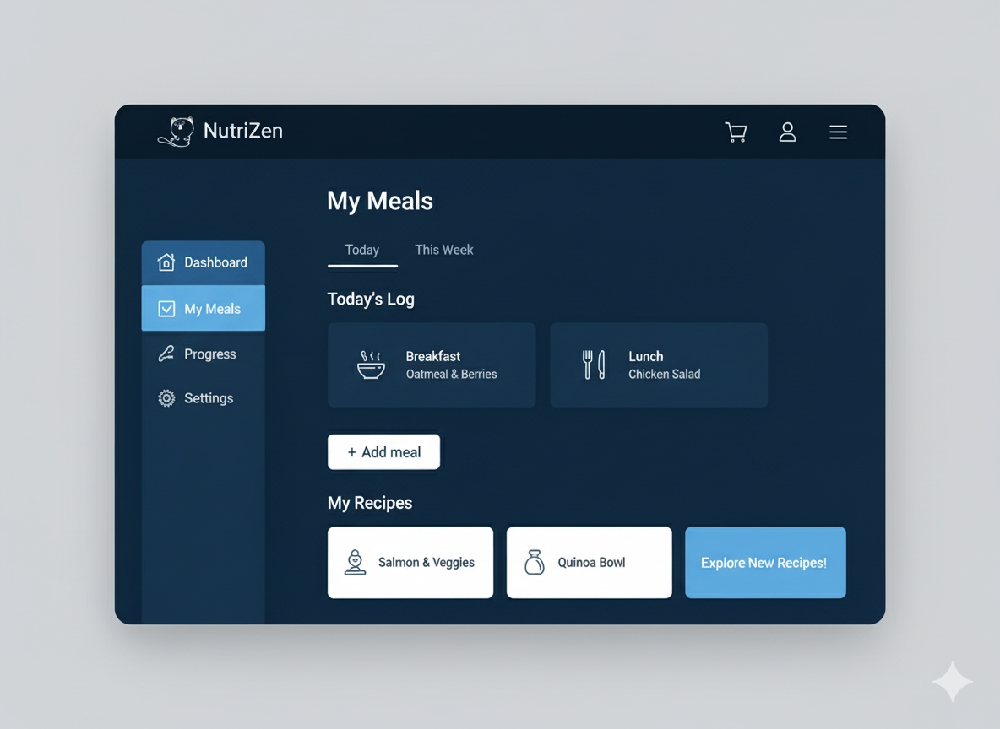
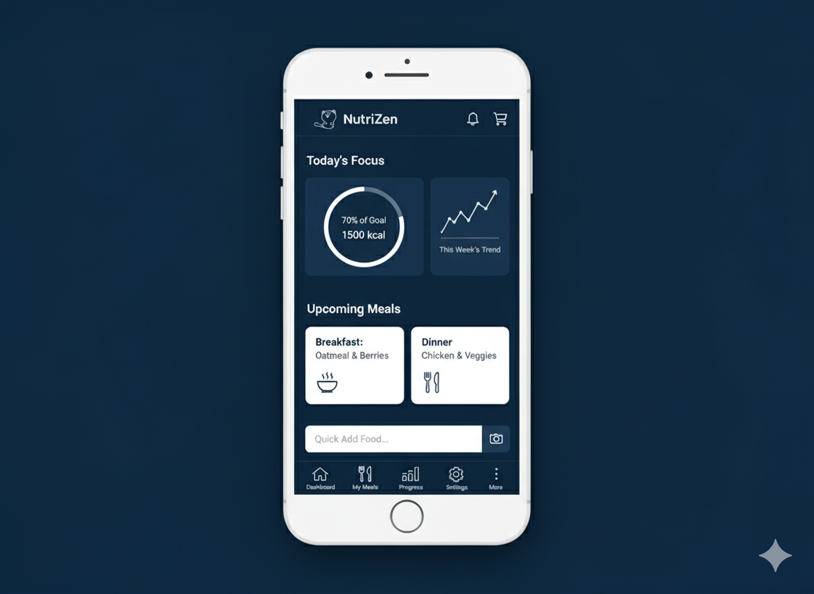

# NutriZen 😺

<a href="README.md">English</a> | <a href="README.pt-BR.md"><strong>Português</strong></a>

  

<h3 align="center">Sua jornada de saúde, construída pela comunidade.</h3>

  Nutrição, treino e bem-estar em um aplicativo 100% gratuito, de código aberto e sem anúncios.

    
    
    
    
    

---

## 📸 Telas / Demonstração (Em desenvolvimento)

  
  

*(Apenas mockups — a interface real será lançada em breve!)*

---

## 💬 Junte-se à Nossa Comunidade

A NutriZen é feita de pessoas. Siga-nos, tire dúvidas e participe da conversa em nossos canais sociais.

  
  
  
  

---

## 💡 Nossa Filosofia

O mercado de aplicativos de saúde está quebrado. Somos bombardeados com anúncios, nossos dados são vendidos e os algoritmos que ditam nossa saúde são caixas-pretas.

**A NutriZen nasceu para ser diferente.**

Nossa missão é criar a ferramenta de saúde mais completa, confiável e transparente do mundo, e entregá-la gratuitamente para todos.

* ✅ **100% Gratuito, Para Sempre:** Todos os recursos essenciais sempre serão gratuitos.
* 📢 **Zero Anúncios:** Uma experiência limpa e focada no que realmente importa: você.
* 📖 **Totalmente Open Source:** O código é seu para ver, auditar e aprimorar.
* 🤝 **Construído pela Comunidade:** Desenvolvedores, designers, nutricionistas e entusiastas unidos por um propósito.

---

## ✨ Roadmap de Funcionalidades

Estamos construindo um ecossistema completo para a sua jornada de bem-estar.

| Categoria | Principais Funcionalidades |
|---|---|
| 🥗 **Nutrição** | Contador de calorias, avaliação corporal, IA para dietas personalizadas, reconhecimento de alimentos por foto, integração com nutricionistas. |
| 💪 **Treino** | IA para planos de treino personalizados, progressão automática, integração com personal trainers. |
| 📊 **Progresso** | Gamificação (sequências, desafios), mural de conquistas, relatórios semanais de progresso. |
| 🌐 **Comunidade** | Grupos de amigos, rankings e um espaço para compartilhar dicas e motivação. |
| 🔗 **Integrações**| Sincronização com wearables (Apple Watch, Fitbit, etc.) e marketplace ético para profissionais. |

➡️ **Confira nosso [Roadmap Público](https://github.com/orgs/Coffee-System/projects/1/views/1) para acompanhar o desenvolvimento de cada funcionalidade!**

---

## 🚀 Contribua e Faça Parte do Futuro da Saúde

**Sua ajuda é a força que move a NutriZen.** Seja você desenvolvedor(a), designer, nutricionista, tradutor(a), escritor(a) ou apenas alguém com uma ótima ideia, há um lugar para você aqui.

Como começar:

1.  **💬 Entre no nosso Discord:** Apresente-se e encontre áreas para colaborar.
2.  **💡 Explore as Tarefas Abertas:** Dê uma olhada nas nossas [Issues no GitHub](https://github.com/Coffee-System/nutrizen/issues).
3.  **📖 Leia nosso Guia de Contribuição:** [CONTRIBUTING.md](CONTRIBUTING.md).
4.  **👨‍💻 Configure seu ambiente:** [Guia de Desenvolvimento](DEVELOPMENT.md).

Procurando um ponto de partida? Veja as [**good first issues**](https://github.com/Coffee-System/nutrizen/labels/good%20first%20issue).

---

## 🛠️ Tecnologias Utilizadas

Estamos usando tecnologias modernas para construir uma plataforma rápida, robusta e escalável.

* **Frontend (Web):** Next.js + TypeScript + Tailwind CSS
* **Frontend (Mobile):** React Native + Expo
* **Backend:** Supabase (PostgreSQL, Auth, Storage) → migração planejada para NestJS
* **Inteligência Artificial:** APIs da OpenAI + modelos HuggingFace
* **Hospedagem:** Vercel & Supabase

➡️ Confira nossa [Documentação Técnica](/docs) para detalhes sobre a arquitetura e padrões.

---

## 🌍 Internacionalização (i18n)

A NutriZen tem como objetivo ser **global**.
Atualmente, damos suporte a:
- 🇺🇸 Inglês
- 🇧🇷 Português (Brasil)

(O inglês é o idioma principal do projeto NutriZen para garantir uma colaboração global eficaz. Acolhemos futuras traduções da plataforma para abraçar uma maior diversidade, mas para manter a consistência no desenvolvimento, o código-fonte permanecerá estritamente em inglês.)

Quer ajudar a traduzir? Junte-se ao esforço nas [Issues do GitHub](https://github.com/Coffee-System/nutrizen/issues).

---

## 🏛️ Licença

Este projeto é distribuído sob a Licença MIT. Veja o arquivo `LICENSE` para mais detalhes.

📄 Também disponível:
- [Política de Privacidade](legal/PRIVACY_POLICY.md)
- [Termos de Serviço](legal/TERMS_OF_SERVICE.md)

---

  <strong>Uma iniciativa da Coffee System nutrida pela comunidade de código aberto.</strong>

