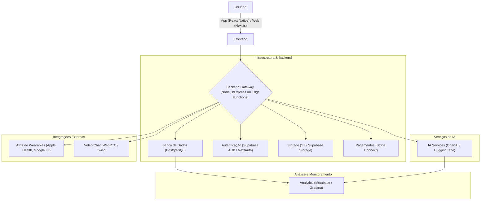

# Arquitetura do NutriZen 🫚

Este documento descreve a arquitetura de alto nível do sistema NutriZen, os componentes principais e as decisões técnicas que guiam nosso desenvolvimento.

## Filosofia de Arquitetura

Nossa arquitetura é guiada pelos seguintes princípios:

* **Comece Simples, Escale Depois:** Usamos serviços gerenciados (BaaS como o Supabase) para acelerar o MVP, com um plano claro para evoluir para soluções mais robustas conforme a necessidade.
* **Ecossistema JavaScript/TypeScript Unificado:** Maximizamos a reutilização de código, lógica e talentos usando um stack baseado em TypeScript de ponta a ponta (frontend, backend, mobile).
* **Monorepo:** Gerenciamos todas as nossas aplicações (`web`, `mobile`) e pacotes compartilhados (`ui`, `utils`) em um único repositório para manter a consistência.

## Visão Geral dos Componentes

Abaixo está um diagrama que ilustra a interação entre os principais componentes do nosso sistema.

* **Frontend:** Aplicação web construída com Next.js e mobile com React Native. Responsável por toda a interface e experiência do usuário.
* **Backend:** Orquestrado inicialmente por Edge Functions e serviços do Supabase, com um plano de migração para um backend dedicado em Node.js (NestJS) para lógicas complexas.
* **Banco de Dados:** Usamos PostgreSQL, hospedado no Supabase, por sua robustez e escalabilidade.
* **Serviços de IA:** Delegamos as tarefas de IA (geração de planos de dieta/treino) para APIs externas como a da OpenAI para garantir resultados de alta qualidade.

## Decisões-Chave

* **Por que Supabase no início?** Para reduzir drasticamente a complexidade e o custo inicial, permitindo que foquemos em entregar valor no MVP.
* **Por que Next.js?** Por sua performance (SSR/SSG), excelente ecossistema e otimizações que facilitam o desenvolvimento de uma aplicação web moderna e rápida.
