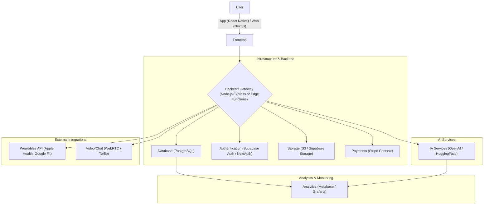

# NutriZen Architecture 🏗️

This document describes the high-level architecture of the NutriZen system, its main components, and the technical decisions that guide our development.

## Architectural Philosophy

Our architecture is guided by the following principles:

* **Start Simple, Scale Later:** We use managed services (BaaS like Supabase) to accelerate the MVP, with a clear plan to evolve to more robust solutions as needed.
* **Unified JavaScript/TypeScript Ecosystem:** We maximize the reuse of code, logic, and talent by using a TypeScript-based stack from end to end (frontend, backend, mobile).
* **Monorepo:** We manage all our applications (`web`, `mobile`) and shared packages (`ui`, `utils`) in a single repository to maintain consistency.

## Component Overview

Below is a diagram illustrating the interaction between the main components of our system.

* **Frontend:** A web application built with Next.js and a mobile app with React Native. Responsible for the entire user interface and experience.
* **Backend:** Initially orchestrated by Edge Functions and Supabase services, with a migration plan to a dedicated Node.js (NestJS) backend for complex business logic.
* **Database:** We use PostgreSQL, hosted on Supabase, for its robustness and scalability.
* **AI Services:** We delegate AI tasks (generating diet/workout plans) to external APIs like OpenAI to ensure high-quality results.

## Key Decisions

* **Why Supabase initially?** To drastically reduce initial complexity and cost, allowing us to focus on delivering value in the MVP.
* **Why Next.js?** For its performance (SSR/SSG), excellent ecosystem, and optimizations that facilitate the development of a modern and fast web application.
